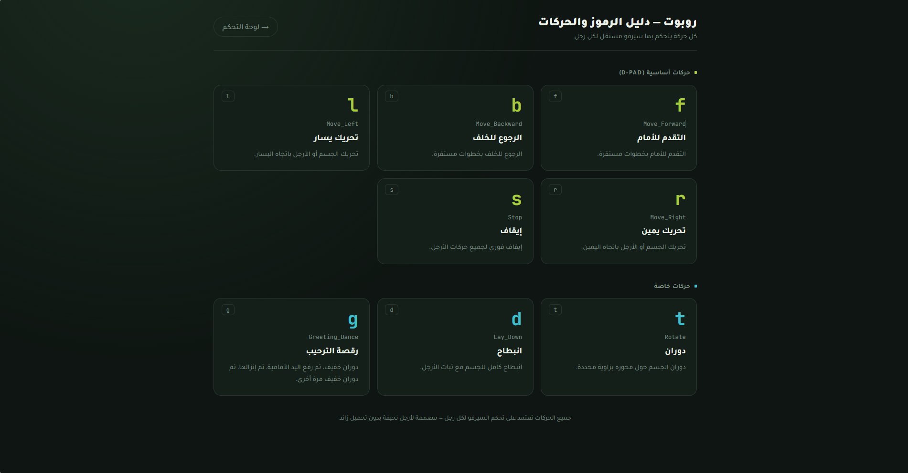
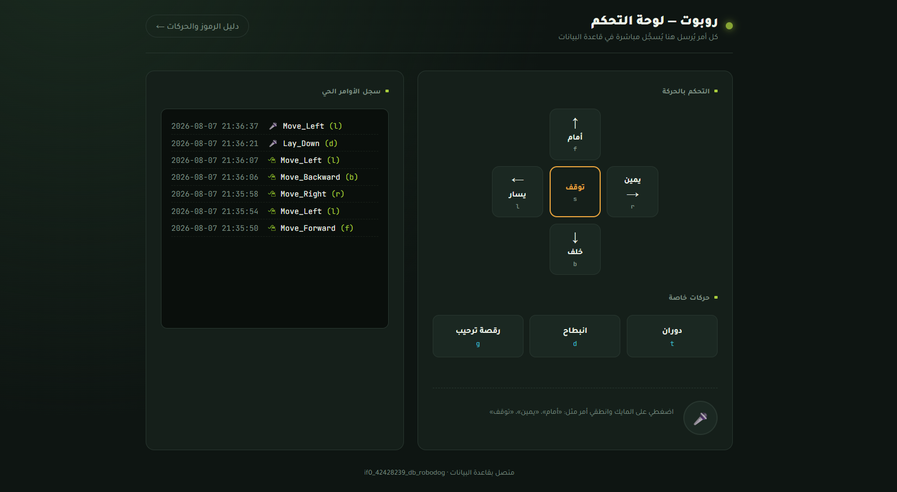

# Robot Control Interface

### A browser-based control interface for interacting with a robot through movement commands.

 

  

---

## The Control System

This project is a browser-based control interface designed to communicate with and operate a robot through a visual command system.

Instead of sending movement instructions directly through code, the interface provides a dedicated control layer where commands can be triggered from the browser and translated into robot movements.

The idea was simple:

> Build a clear control interface that makes interacting with the robot easier to operate, understand, and experiment with.

---

## Core Capabilities

### Robot Control

The interface provides direct controls for sending movement commands to the robot through both voice commands and button interaction.

Each control represents a specific movement or action, allowing the robot to be operated directly through the browser.

### Movement Commands

Robot movements are represented through predefined command inputs.

This creates a simple communication layer between the browser interface and the robot, making individual actions easier to test and control.

### Movement Guide

The movement guide provides a visual reference for the available commands and their corresponding robot actions.

It makes the command system easier to understand when working with different movements and sequences.

---

## How It Works

The interface acts as a control layer between the user and the robot.

At a high level, the interaction follows:

`Voice / Button Input → Web Interface → Movement Command → Robot`

Each interaction begins in the browser, where a movement can be triggered through voice input or selected through the available controls. The corresponding command is then sent through the control layer for the robot to execute.

---

## Interface

### Main Control Interface

The main interface provides the controls required to interact with the robot and trigger its available movements.

### Movement Reference

The movement reference acts as a visual command guide, showing how the available controls correspond to different robot movements.

---

## Tech Stack

| Layer         | Technology                |
| ------------- | ------------------------- |
| Frontend      | HTML5 · CSS3 · JavaScript |
| Backend       | PHP                       |
| Communication | HTTP                      |
| Interface     | Browser-Based Web UI      |

The interface is intentionally lightweight and designed to run directly from the browser.

---

## Running Locally

If you want to experiment with the interface and run the project yourself, serve the project through a PHP-compatible server.

For example:

`php -S localhost:8000`

Then open `http://localhost:8000` in your browser.

---

## Enter the Experience

---

## Why I Built It

I wanted to explore how a browser-based interface could be used as a practical control layer for a physical robot.

The project combines web interaction with robot movement commands, creating a simple bridge between a visual interface and physical actions.

The result is a lightweight control system designed to make robot movement easier to operate, visualize, and understand.
